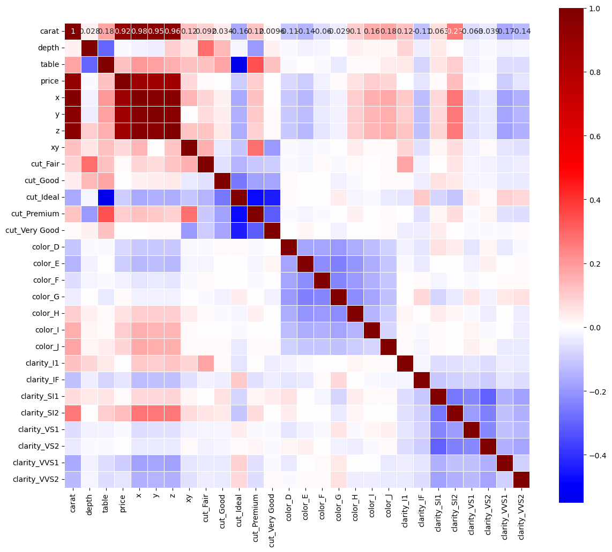

# Project Overview
---
Using everyones favorite Diamond dataset, I was able to predict the selling price of the Diamonds in the data with a high degree of accuracy wiht the variables I was given. 
### Tools
- Python was used to transform, explore, evaluate the data, and to build the machine learning model.
  - Powershell was used to create a custom 'Conda' virtual enviroment and to install all the nessecary packages.
- PowerBI was used to visualize the data and the model results.
## Python
In the following section I'll walkthrough key points of the project as well as some of the code.
---
To give you an idea of what the data looks like I'll first display the first 5 rows out of the 53,940 in the entire dataset.
```python
df.head()
```
<table border="1" class="dataframe">
  <thead>
    <tr style="text-align: right;">
      <th></th>
      <th>carat</th>
      <th>cut</th>
      <th>color</th>
      <th>clarity</th>
      <th>depth</th>
      <th>table</th>
      <th>price</th>
      <th>x</th>
      <th>y</th>
      <th>z</th>
    </tr>
  </thead>
  <tbody>
    <tr>
      <th>0</th>
      <td>0.23</td>
      <td>Ideal</td>
      <td>E</td>
      <td>SI2</td>
      <td>61.5</td>
      <td>55.0</td>
      <td>326</td>
      <td>3.95</td>
      <td>3.98</td>
      <td>2.43</td>
    </tr>
    <tr>
      <th>1</th>
      <td>0.21</td>
      <td>Premium</td>
      <td>E</td>
      <td>SI1</td>
      <td>59.8</td>
      <td>61.0</td>
      <td>326</td>
      <td>3.89</td>
      <td>3.84</td>
      <td>2.31</td>
    </tr>
    <tr>
      <th>2</th>
      <td>0.23</td>
      <td>Good</td>
      <td>E</td>
      <td>VS1</td>
      <td>56.9</td>
      <td>65.0</td>
      <td>327</td>
      <td>4.05</td>
      <td>4.07</td>
      <td>2.31</td>
    </tr>
    <tr>
      <th>3</th>
      <td>0.29</td>
      <td>Premium</td>
      <td>I</td>
      <td>VS2</td>
      <td>62.4</td>
      <td>58.0</td>
      <td>334</td>
      <td>4.20</td>
      <td>4.23</td>
      <td>2.63</td>
    </tr>
    <tr>
      <th>4</th>
      <td>0.31</td>
      <td>Good</td>
      <td>J</td>
      <td>SI2</td>
      <td>63.3</td>
      <td>58.0</td>
      <td>335</td>
      <td>4.34</td>
      <td>4.35</td>
      <td>2.75</td>
    </tr>
  </tbody>
</table>
</div>

## Feature Engineering
In order to reduce the complexity of the data I create a ratio of two of two demensions and elect to drop the original columns
```Python
df['xy'] = df['x']/df['y'] 

# Encode categorical variables into machine readable values
d_df = pd.get_dummies(df)
X = d_df.drop(['price', 'x', 'y', 'z'], axis=1) # Dropping target variable & highly correlated columns
y = d_df['price']

corr_heatmap(d_df.corr()) # Calling my correlation variable (see notebook)

```
### Correlation Heatmap


# Model Evaluation
## RMSE results
- Think of RMSE as the average error of the predicted metric
<div>

<table border="1" class="dataframe">
  <thead>
    <tr style="text-align: right;">
      <th></th>
      <th>RMSE</th>
    </tr>
  </thead>
  <tbody>
    <tr>
      <th>KNN</th>
      <td>1170.659452</td>
    </tr>
    <tr>
      <th>MLR</th>
      <td>1120.830488</td>
    </tr>
    <tr>
      <th>RF</th>
      <td>552.995054</td>
    </tr>
    <tr>
      <th>Lasso</th>
      <td>1120.723179</td>
    </tr>
    <tr>
      <th>Null(mean y value)</th>
      <td>3942.168776</td>
    </tr>
  </tbody>
</table>
</div>

## R2 results
- The closer the model is to 1 the better the model is
<div>
<style scoped>
    .dataframe tbody tr th:only-of-type {
        vertical-align: middle;
    }

    .dataframe tbody tr th {
        vertical-align: top;
    }

    .dataframe thead th {
        text-align: right;
    }
</style>
<table border="1" class="dataframe">
  <thead>
    <tr style="text-align: right;">
      <th></th>
      <th>R2</th>
    </tr>
  </thead>
  <tbody>
    <tr>
      <th>KNN</th>
      <td>0.91133</td>
    </tr>
    <tr>
      <th>MLR</th>
      <td>0.918722</td>
    </tr>
    <tr>
      <th>RF</th>
      <td>0.980161</td>
    </tr>
    <tr>
      <th>Lasso</th>
      <td>0.918734</td>
    </tr>
  </tbody>
</table>
</div>

# Exporting model
```Python
# Save ML model to disk
import pickle
import os

# Directory path and file names
directory_path = r"C:\Users\conno\workspace\projects\diamond_price_prediction\resources"
model_file_name = 'random_forest_model.pkl'
scaler_file_name = 'scaler.pkl'
processed_data_file_name = 'processed_diamond_data.csv'

# Full paths
model_full_path = os.path.join(directory_path, model_file_name)
scaler_full_path = os.path.join(directory_path, scaler_file_name)
data_full_path = os.path.join(directory_path, processed_data_file_name)

# Save ML model to disk
with open(model_full_path, 'wb') as model_file:
    pickle.dump(rf, model_file)

with open(scaler_full_path, 'wb') as scaler_file:
    pickle.dump(s, scaler_file)

# Saving the processed data as a csv
df.to_csv(data_full_path, index=False)
```
<div>
<style scoped>
    .dataframe tbody tr th:only-of-type {
        vertical-align: middle;
    }

    .dataframe tbody tr th {
        vertical-align: top;
    }

    .dataframe thead th {
        text-align: right;
    }
</style>
<table border="1" class="dataframe">
  <thead>
    <tr style="text-align: right;">
      <th></th>
      <th>carat</th>
      <th>cut</th>
      <th>color</th>
      <th>clarity</th>
      <th>depth</th>
      <th>table</th>
      <th>price</th>
      <th>x</th>
      <th>y</th>
      <th>z</th>
      <th>xy</th>
      <th>predictions</th>
    </tr>
  </thead>
  <tbody>
    <tr>
      <th>0</th>
      <td>0.23</td>
      <td>Ideal</td>
      <td>E</td>
      <td>SI2</td>
      <td>61.5</td>
      <td>55.0</td>
      <td>326</td>
      <td>3.95</td>
      <td>3.98</td>
      <td>2.43</td>
      <td>0.992462</td>
      <td>377.0</td>
    </tr>
    <tr>
      <th>1</th>
      <td>0.21</td>
      <td>Premium</td>
      <td>E</td>
      <td>SI1</td>
      <td>59.8</td>
      <td>61.0</td>
      <td>326</td>
      <td>3.89</td>
      <td>3.84</td>
      <td>2.31</td>
      <td>1.013021</td>
      <td>404.8</td>
    </tr>
    <tr>
      <th>2</th>
      <td>0.23</td>
      <td>Good</td>
      <td>E</td>
      <td>VS1</td>
      <td>56.9</td>
      <td>65.0</td>
      <td>327</td>
      <td>4.05</td>
      <td>4.07</td>
      <td>2.31</td>
      <td>0.995086</td>
      <td>349.6</td>
    </tr>
    <tr>
      <th>3</th>
      <td>0.29</td>
      <td>Premium</td>
      <td>I</td>
      <td>VS2</td>
      <td>62.4</td>
      <td>58.0</td>
      <td>334</td>
      <td>4.20</td>
      <td>4.23</td>
      <td>2.63</td>
      <td>0.992908</td>
      <td>372.0</td>
    </tr>
    <tr>
      <th>4</th>
      <td>0.31</td>
      <td>Good</td>
      <td>J</td>
      <td>SI2</td>
      <td>63.3</td>
      <td>58.0</td>
      <td>335</td>
      <td>4.34</td>
      <td>4.35</td>
      <td>2.75</td>
      <td>0.997701</td>
      <td>402.1</td>
    </tr>
  </tbody>
</table>
</div>

# PowerQuery
The following moduel is me importing the model I created and exported in the project notebook and loading said model into Power BI via PowerQuery.
  - The Python code after is the actual Python script itself, step 'Run_Python_script', but in a more readable format
```M
let
    Source = Csv.Document(File.Contents("C:\Users\conno\workspace\projects\diamond_price_prediction\resources\processed_diamond_data.csv"),[Delimiter=",", Columns=11, Encoding=1252, QuoteStyle=QuoteStyle.None]),
    PromotedHeaders = Table.PromoteHeaders(Source, [PromoteAllScalars=true]),

    Run_Python_script = Python.Execute("# 'dataset' holds the input data for this script#(lf)import pandas as pd#(lf)import pickle#(lf)#(lf)# Loading random forest model & scaler#(lf)file_path = r""C:\Users\conno\workspace\projects\diamond_price_prediction\resources\random_forest_model.pkl""#(lf)scaler_path = r""C:\Users\conno\workspace\projects\diamond_price_prediction\resources\scaler.pkl""#(lf)with open(file_path, 'rb') as file:#(lf)    model = pickle.load(file)#(lf)with open(scaler_path, 'rb') as scaler_file:#(lf)    scaler = pickle.load(scaler_file)#(lf)#(lf)# Feature Engineering#(lf)d_dataset = pd.get_dummies(dataset)#(lf)d_dataset = d_dataset.drop(['price', 'x', 'y', 'z'], axis=1)#(lf)X = scaler.transform(d_dataset)#(lf)#(lf)# Make predictions#(lf)dataset['predictions'] = model.predict(X)",[dataset=PromotedHeaders]),
    dataset = Run_Python_script{[Name="dataset"]}[Value],

    // The index will serve as our data points on the scatter plot
    Added_Index = Table.AddIndexColumn(dataset, "Index", 0, 1, Int64.Type),
    Changed_DType = Table.TransformColumnTypes(Added_Index,{{"carat", type number}, {"cut", type text}, {"color", type text}, {"clarity", type text}, {"depth", type number}, {"table", type number}, {"price", Int64.Type}, {"x", type number}, {"y", type number}, {"z", type number}, {"xy", type number}, {"predictions", Int64.Type}})
in
    Changed_DType
```

```Python
# 'dataset' holds the input data for this script
import pandas as pd
import pickle

# Loading random forest model & scaler
file_path = r"C:\Users\conno\workspace\projects\diamond_price_prediction\resources\random_forest_model.pkl"
scaler_path = r"C:\Users\conno\workspace\projects\diamond_price_prediction\resources\scaler.pkl"
with open(file_path, 'rb') as file:
    model = pickle.load(file)
with open(scaler_path, 'rb') as scaler_file:
    scaler = pickle.load(scaler_file)

# Feature Engineering
d_dataset = pd.get_dummies(dataset)
d_dataset = d_dataset.drop(['price', 'x', 'y', 'z'], axis=1)
X = scaler.transform(d_dataset)

# Make predictions
dataset['predictions'] = model.predict(X)
```